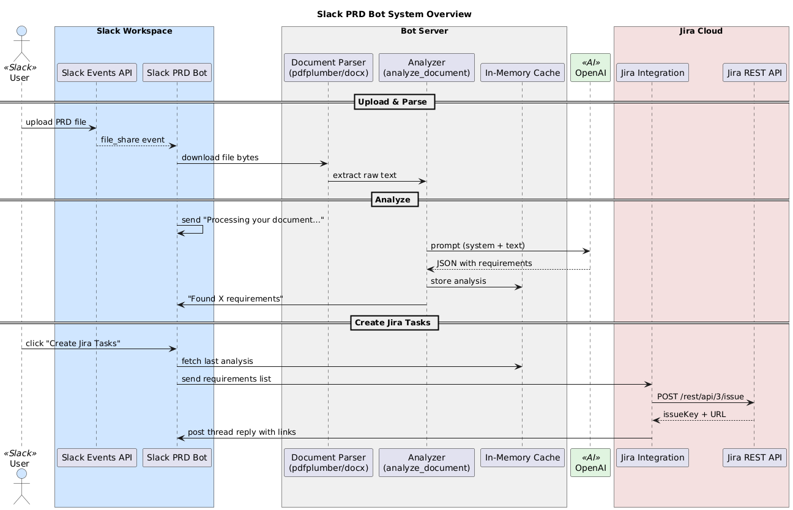

# Slack PRD Bot

A Slack bot that lets you drop a Product Requirements Document (PRD) into any channel, automatically extracts “shall”-style requirements via OpenAI, shows you a preview, and—on your confirmation—creates one Jira issue per requirement.

---

## Table of Contents

1. [Demo](#demo)  
2. [Features](#features)  
3. [Architecture & Flow](#architecture--flow)  
4. [Tech Stack & Key Libraries](#tech-stack--key-libraries)  
5. [Getting Started](#getting-started)  
   1. [Prerequisites](#prerequisites)  
   2. [Installation](#installation)  
   3. [Configuration](#configuration)  
   4. [Running the Bot](#running-the-bot)  
6. [Project Structure & File Roles](#project-structure--file-roles)  
7. [Design Choices & Algorithms](#design-choices--algorithms)  
8. [Error Handling & Edge Cases](#error-handling--edge-cases)  
9. [Future Improvements](#future-improvements)  
10. [License & Acknowledgements](#license--acknowledgements)  

---

## Demo

1. **Upload** a PDF/DOCX/TXT PRD into Slack.  
2. Bot replies “Processing your document…” then “Found N requirements” with a **Create Jira Tasks** button.  
3. Click the button → Bot creates Jira issues and replies in-thread with clickable issue links.

---

## Features

- **Automatic requirement extraction** via OpenAI (GPT-4o)  
- **Interactive Slack flow** with “Processing…” acknowledgment  
- **Preview** of extracted requirements before Jira creation  
- **One Jira issue per requirement** with summary, description and labels  
- **Custom priority mapping**, assignee, and time-estimate fields  
- **In-memory caching** of analysis results between upload & button click  

---

## Architecture & Flow

Below is the end-to-end sequence showing how a user’s PRD upload flows through Slack, our bot, OpenAI, the in-memory cache, Jira integration, and back into Slack:



```
┌───────────┐
│  Slack    │── file_shared event ──► Slack PRD Bot ──┐
│ Workspace │                                         │
└───────────┘                                         ▼
                                         downloads file bytes
                                               │
                                               ▼
                                         Document Parser
                                  (pdfplumber / python-docx)
                                               │
                                               ▼
                                    Analyzer (analyze_document)
            ┌─────────── prompt (system+user) ──►│
            │                                  OpenAI
            │   ◄───────────────────────────── JSON requirements
            │                                                          ┌─────────┐
            │                                                          │ Jira    │
            │   ◄───────────── store analysis ──── In-Memory ─────────►│ Cloud   │
            │                                        Cache      POST   └─────────┘
            │                                   retrieve items
            │                                                          ▲
            └───── post summary & “Create Jira Tasks” button ──────────┘
            
```
---

Tech Stack & Key Libraries

    Language: Python 3.10+

    Slack integration: slack-bolt

    PDF parsing: pdfplumber

    DOCX parsing: python-docx

    LLM calls: OpenAI Python SDK (GPT-4o)

    Jira integration: requests + Jira Cloud REST API

    Data modeling & validation: Pydantic

    In-memory cache: Python dict (per-instance)

---

Getting Started
Prerequisites

    Python 3.10 or higher

    A Slack App with bot token & signing secret

    OpenAI API key

    Jira Cloud account + API token + target project key

Installation
```
git clone https://github.com/your-org/Slack_PRD_Bot.git
cd Slack_PRD_Bot
python3 -m venv .venv
source .venv/bin/activate        # macOS/Linux
.\.venv\Scripts\activate         # Windows PowerShell
pip install -r requirements.txt
```

---

Configuration

Copy .env.example to .env and fill in:

SLACK_BOT_TOKEN= xoxb-...
SLACK_SIGNING_SECRET= ...
OPENAI_API_KEY= sk-...
JIRA_URL= https://your-domain.atlassian.net
JIRA_EMAIL= your.email@example.com
JIRA_API_TOKEN= ...
JIRA_PROJECT_KEY= SCRUM

Running the Bot

python app.py

---

Project Structure & File Roles
```
bot/
├── __init__.py           # (empty) package marker
├── config.py             # Loads env vars into Config.*
├── analysis.py           # extract_text + analyze_document logic
├── jira_integration.py   # create_jira_tasks(requirements)
└── slack_handlers.py     # Slack event & action listeners + in-memory cache
app.py                    # Bootstraps Bolt App and registers handlers
requirements.txt          # pinned dependencies
README.md                 # ← You are here!

    config.py
    Centralizes credentials & URLs as a Pydantic settings model.

    analysis.py

        extract_text(bytes, filename)
        Falls back between PDF, DOCX, or plain-text decoding.

        analyze_with_openai(text) & analyze_document(...)
        Sends system+user prompt to OpenAI, parses JSON into Pydantic models.

    slack_handlers.py

        handle_file_shared_event: listens for file uploads, acknowledges “Processing…”, downloads file, invokes analyze_document(), caches results, posts preview + button.

        handle_create_tasks: on button click, retrieves cached requirements, calls Jira integration, replies with issue links.

    jira_integration.py

        create_jira_tasks(requirements): maps PRD priorities, builds ADF description block, posts to Jira API, handles rate-limits & errors, returns keys & URLs.
``` 
---

 Design Choices & Algorithms

We’ve built the Slack PRD Bot with four guiding principles that make it robust, maintainable, and easy to extend:
```
    **Prompt Engineering**

        - Expert Business Analyst: Our system prompt casts the LLM as a domain-expert, ensuring every requirement is framed and extracted with the right context.

        - Deterministic Extraction: We use a very low temperature (0.1) so the model’s outputs are consistent, making automated parsing reliable.

     **In-Memory Cache**

        - UUID Keying: Every upload generates a short uuid4() key. We store the parsed requirements in a simple Python dict[file_id] → List[Requirement].

        - No External Storage: Keeps user data transient and avoids spinning up an external database—everything lives in RAM until the next bot restart.

     **Modular Separation**

        Single-Responsibility Files:

            - analysis.py → orchestrates document text extraction and LLM calls

            - jira_integration.py → handles all Jira REST API interactions (including retries on 429s)

            - slack_handlers.py → wires Slack Events API to our business logic

           -  app.py → bootstraps the Bolt for Python Slack app

        **Pydantic Models**: We validate every extracted requirement against a strict schema (RequirementExtractionResponse), catching malformed responses before they ever reach Jira.

     **Error Resilience**

        **Rate-Limit Retries**: Automatic back-off and retry logic on HTTP 429 responses from Jira.

        **File Fallbacks**: For unknown or malformed uploads, we gracefully handle:

            - PDF via pdfplumber

            - DOCX via python-docx

            - Plain TXT via safe UTF-8 decode

        **User-Friendly Messaging**: Any errors encountered during parsing or ticket creation are caught and reported back into the original Slack thread with clear guidance.
```

--- 

Error Handling & Edge Cases
```
    Malformed PRDs → “Found 0 requirements” + still shows button

    OpenAI JSON parse failure → logged & user notified with generic error

    Jira API errors → per-requirement logs, then abort with thread notification

    Cache misses (button clicked after restart) → empty list & user informed
 ```
   
---

## Future Improvements

- **Full-fledged AI virtual assistant** for managers and CxO’s, integrating with Slack and other corporate apps to simplify workflows via natural-language commands  
- **Channel context tracking** to generate “what you missed” catch-up reports for users returning from extended leave  
- Persistent cache with Redis to survive restarts  
- Support for Markdown (.md) and HTML (.html) uploads via a lightweight parser  
- Configurable Slack channels & Jira epics per upload command  
- Batching of Jira API calls and more robust back-pressure handling  
- Unit & integration tests for easier CI/CD  
- Dockerization for one-click deployment  

---

## Demo

For a full, comprehensive walkthrough of the bot in action, check out this video:

[▶️ Full Comprehensive Demo for the Bot](https://youtu.be/GGFjIB02L5U)

© 2025 Aditya Chaudhary
Built with ☕ Python, 🤖 OpenAI, 🐍 community libraries & 🤖 GenAI.
